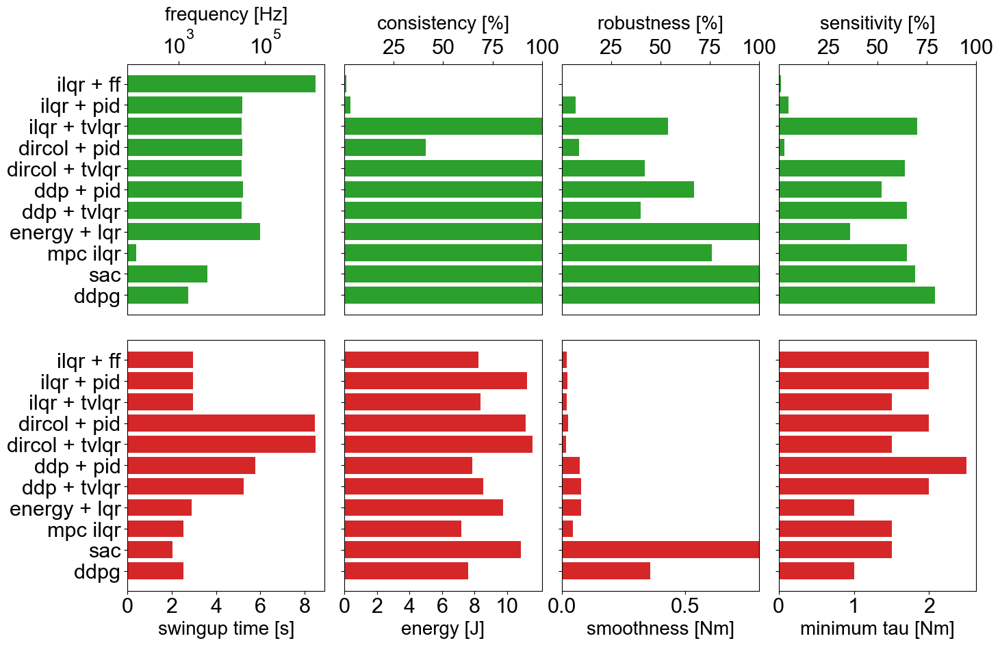
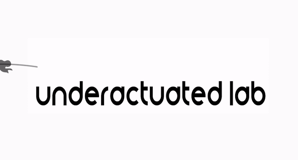

# Torque Limited Simple Pendulum

## Introduction #

The project is an open-source and low-cost kit to get started with underactuated robotics. The kit targets lowering the entry barrier for studying underactuation in real systems which is often overlooked in conventional robotics courses. It implements a **torque-limited simple pendulum** built using a quasi-direct drive motor which allows for a low friction, torque limited setup. This project describes the _offline_ and _online_ control methods which can be studied using the kit, lists its components, discusses best practices for implementation, presents results from experiments with the simulator and the real system. This repository describes the hardware (CAD, Bill Of Materials (BOM) etc.) required to build the physical system and provides the software (URDF models, simulation and controller) to control it.

**See the simple pendulum in action:** 

## Documentation

The full documentation for this repository can be found [here](https://dfki-ric-underactuated-lab.github.io/torque_limited_simple_pendulum/).

As a quick start, we refer to the following readme files:

* [Software Installation Guide](docs/reference/source/chapters/00.installation_guide.rst)
* [Code Testing](docs/reference/source/chapters/02.code_testing.rst)
* [Pendulum Dynamics](docs/reference/source/chapters/03.model.rst)
* [Hardware & Testbench Description](hardware/testbench_description.md)
* [Motor Configuration](hardware/motor_configuration.md)
* [Hardware Usage Instructions](docs/reference/source/chapters/01.usage_instructions.rst)

Additionally, we uploaded all CAD files to grabcad.com. You can use the 3D viewer from their webiste to diplay the 3D model directly within your browser: 

* [grabcad.com/simple_pendulum](https://grabcad.com/library/simple_pendulum-1)

## Overview of Methods #

**Trajectory Optimization** tries to find a trajectory of control inputs and states that is feasible for the system while minimizing a cost function. The cost function can for example include terms which drive the system to a desired goal state and penalize the usage of high torques. The following trajectory optimization algorithms are implemented:

* [Direct Collocation](software/python/simple_pendulum/trajectory_optimization/direct_collocation): A collocation method, which transforms the optimal control problem into a mathematical programming problem which is solved by sequential quadratic programming. For more information, click [here](https://arc.aiaa.org/doi/pdf/10.2514/3.20223)
* [Iterative Linear Quadratic Regulator (iLQR)](software/python/simple_pendulum/trajectory_optimization/ilqr): A optimization algorithm which iteratively linearizes the system dynamics and applies LQR to find an optimal trajectory. For more information, click [here](https://ieeexplore.ieee.org/abstract/document/6907001)
* [Feasability driven Differential Dynamic Programming (FDDP)](software/python/simple_pendulum/trajectory_optimization/ddp): Trajectory optimization using locally quadratic dynamics and cost models. For more information about DDP, click [here](https://www.tandfonline.com/doi/abs/10.1080/00207176608921369) and for FDDP, click [here](https://arxiv.org/abs/1909.04947)

The optimization is done with a simulation of the pendulum dynamics.

**Reinforcement Learning** (RL) can be used to learn a policy on the state space of the robot, which then can be used to control the robot. The simple pendulum can be formulated as a RL problem with two continuous inputs and one continuous output. Similar to the cost function in trajectory optimization, the policy is trained with a reward function. The following RL algorithms are implemented:

* [Soft Actor Critic (SAC)](software/python/simple_pendulum/controllers/sac): An off-policy model free reinforcement learning algorithm. Maximizes a trade-off between expected return of a reward function and entropy, a measure of randomness in the policy. [reference](https://arxiv.org/abs/1801.01290)
* [Deep Deterministic Policy Gradient (DDPG)](software/python/simple_pendulum/controllers/ddpg): An off-policy reinforcement algorithm which concurrently learns a Q-function and uses this Q-function to train a policy in the state space. [reference](https://arxiv.org/abs/1509.02971v6)

Both methods, are model-free, i.e. they use the dynamics of the system as a black box. Currently, learning is possible in the simulation environment.

**Trajectory-based Controllers** act on a precomputed trajectory and ensure that the system follows the trajectory properly. The trajectory-based controllers implemented in this project are:

* [Feed-forward torque Controller](software/python/simple_pendulum/controllers/open_loop): Simple forwarding of a control signal from a precomputed trajectory.
* [Proportional-Integral-Derivative (PID)](software/python/simple_pendulum/controllers/pid): A controller reacting to the position error, integrated error and error derivative to a precomputed trajectory.
* [Time-varying Linear Quadreatic Regulator (tvLQR)](software/python/simple_pendulum/controllers/tvlqr): A controller which linearizes the system dynamics at every timestep around the precomputed trajectory and uses LQR to drive the system towards this nominal trajectory.
* [Model predictive control with iLQR](software/python/simple_pendulum/controllers/ilqr): A controller which performs an iLQR optimization at every timestep and executes the first control signal of the computed optimal trajectory.

Feedforward and PID controller operate model independent, while the TVLQR and iLQR MPC controllers utilize knowledge about the pendulum model. In contrast to the others, the iLQR MPC controller optimizes over a predefined horizon at every timestep.

**Policy-based Controllers** take the state of the system as input and ouput a control signal. In contrast to trajectory optimization, these controllers do not compute just a single trajectory. Instead, they react to the current state of the pendulum and because of this they can cope with perturbations during the execution. The following policy-based controllers are implemented:

* [Gravity Compensation](software/python/simple_pendulum/controllers/gravity_compensation): A controller compensating the gravitational force acting on the pendulum. The pendulum can be moved as if it was in zero-g.
* [Energy Shaping](software/python/simple_pendulum/controllers/energy_shaping): A controller regulating the energy of the pendulum. Drives the pendulum towards a desired energy level.
* [Linear Quadratic Regulator (LQR)](software/python/simple_pendulum/controllers/lqr): Linearizes the dynamics around a fixed point and drives the pendulum towards the fixpoint with a quadratic cost function. Only useable in a state space region around the fixpoint.

All of these controllers utilize model knowledge. Additionally, the control policies, obtained by one of the RL methods, fall in the category of policy-based control.

The implementations of direct collocation and TVLQR make use of [drake](https://drake.mit.edu/doxygen_cxx/), iLQR makes use of the symbolic library of drake or sympy, FDDP makes use of [Crocoddyl](https://gepettoweb.laas.fr/doc/loco-3d/crocoddyl/master/doxygen-html/), SAC uses the [stable-baselines3](https://stable-baselines3.readthedocs.io/en/master/) implementation and DDPG is implemented in [tensorflow](https://www.tensorflow.org/). The other methods use only standard libraries.

The controllers can be benchmarked in simulation with a set of predefined [criteria](software/python/simple_pendulum/analysis).

<!---
## Folder Structure #

<table>
	<tr>
        <td><ul>
                <li><b>data/</b>
                <ul>
                    <li><b>benchmarks/</b></li>
                    <li><b>models/</b> (Machine Learning models)</li>
                    <li><b>parameters/</b></li>
                    <li><b>trajectories/</b> (CSV files with position, velocity and torque data)</li>
                    <li><b>urdf/</b></li>
                </ul>
                <li><b>docs/</b> (Documentation)
                <li><b>hardware/</b>
                <ul>
                    <li><b>CAD/</b></li>
                </ul>
                <li><b>results/</b></li>
                <li><b>software/</b></li>
                <ul>
                    <li><b>python/</b>
                    <ul>
                        <li><b>simple_pendulum/</b>
                        <ul>
                            <li><b>analysis/</b></li>
                            <li><b>controllers/</b></li>
                            <li><b>model/</b></li>
                            <li><b>reinforcement_learning/</b></li>
                            <li><b>simulation/</b></li>
                            <li><b>trajectory_optimization/</b></li>
                            <li><b>utilities/</b></li>
                        </ul>
                        <li><b>examples/</b></li>
                        <li><b>examples_real_system/</b></li>
                    </ul>
                </ul>
            </ul>
    </tr>
</table>
-->

## Authors #

* [Shivesh Kumar](https://robotik.dfki-bremen.de/en/about-us/staff/shku02.html) (Project Supervisor)
* [Felix Wiebe](https://robotik.dfki-bremen.de/en/about-us/staff/fewi01.html) (Software Maintainer)
* [Jonathan Babel](https://robotik.dfki-bremen.de/en/about-us/staff/joba02.html) (Hardware Maintainer)
* [Daniel Harnack](https://robotik.dfki-bremen.de/en/about-us/staff/daha03.html)
* [Heiner Peters](https://robotik.dfki-bremen.de/en/about-us/staff/hepe02.html)
* [Shubham Vyas](https://robotik.dfki-bremen.de/en/about-us/staff/shvy01/)
* [Melya Boukheddimi](https://robotik.dfki-bremen.de/en/about-us/staff/mebo01/)
* [Mihaela Popescu](https://robotik.dfki-bremen.de/en/about-us/staff/mipo02/)

Feel free to contact us if you have questions about the test bench. Enjoy!

## Contributing

1. Fork it (<https://github.com/yourname/yourproject/fork>)
2. Create your feature branch (`git checkout -b feature/fooBar`)
3. Commit your changes (`git commit -am 'Add some fooBar'`)
4. Push to the branch (`git push origin feature/fooBar`)
5. Create a new Pull Request

See [Contributing](CONTRIBUTING.md) for more details.

## Safety Notes #

When working with a real system be careful and mind the following safety measures:

* Brushless motors can be very powerful, moving with tremendous force and speed. Always limit the range of motion, power, force and speed using configurable parameters, current limited supplies, and mechanical design.

* Stay away from the plane in which pendulum is swinging. It is recommended to have a safety net surrounding the pendulum in case the pendulum flies away.

* Make sure you have access to emergency stop while doing experiments. Be extra careful while operating in pure torque control loop.

## Acknowledgements #
This work has been performed in the VeryHuman project funded by the German Aerospace Center (DLR) with federal funds (Grant Number: FKZ 01IW20004) from the Federal Ministry of Education and Research (BMBF) and is additionally supported with project funds from the federal state of Bremen for setting up the Underactuated Robotics Lab (Grant Number: 201-001-10-3/2021-3-2).

## License

This work has been released under the BSD 3-Clause License. Details and terms of use are specified in the LICENSE file within this repository. Note that we do not publish third-party software, hence software packages from other developers are released under their very own terms and conditions, e.g. Stable baselines (MIT License) and Tensorflow (Apache License v2.0). If you install third-party software packages along with this repo ensure  that you follow each individual license agreement.   

## Citation

Felix Wiebe, Jonathan Babel, Shivesh Kumar, Shubham Vyas, Daniel Harnack, Melya Boukheddimi, Mihaela Popescu, Frank Kirchner. Torque-limited simple pendulum: A toolkit for getting familiar with control algorithms in underactuated robotics. In: Journal of Open Source Software (JOSS). (submitted)

-----------------------------------------------------------------------------------------------------------------------------
