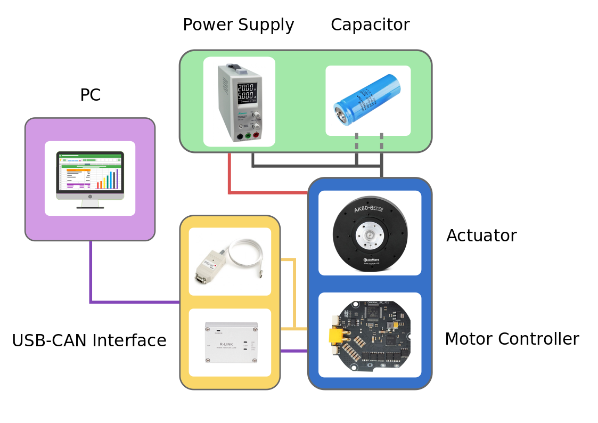

<div align="center">

#  Simple Pendulum
</div>


# Test setup

The wiring diagram below shows how the simple pendulum testbench is set up. A main PC is connected to a motor controller board (CubeMars_AK_V1.1) mounted on the actuator (AK80-6 from T-Motor). The communication takes place on a CAN bus with a maximum signal frequency of 1Mbit/sec with the 'classical' CAN protocol. Furthermore, a USB to CAN interface is needed, if the main pc doesn't have a PCI CAN card. Two different devices are used in our setup: the R-LINK module from T-Motor and the PCAN-USB adapter from PEAK systems. The former has CAN and UART connectors at the output, but only works with Windows. The latter only features CAN connection, but works with Linux. The UART connector of the R-LINK module is usefull to configure and calibrate the AK80-6.   

The actuator requires an input voltage of 24 Volts and consumes up to 24 Amps under full load. A power supply that is able to deliver both and which is used in our test setup is the EA-PS 9032-40 from Elektro-Automatik. A capacitor filters the backEMF coming from the actuator and therefore protects the power supply from high voltage peaks. This wouldn't be necessary if the actuator is powered from a battery pack, as in this case backEMF simply recharges the batteries. The capacitor we use is made of 10x single 2.7V-400F capacitor cells connected in series. A emergency stop button serves as additional safety measure. It disconnects the actuator from the power supply and from the capacitor (Note: If only the power supply is switched off the actuator will continue to run from the energy stored in the capacitor).   

<div align="center">
  
</div>  

**Fig. 1:** actuator = AK80-6, controller board = CubeMars_AK_V1.1, power supply = EA-PS 9032-40, capacitor = 10x 2.7V-400F cells connected in series, USB-CAN interfaces = R-LINK module and PCAN-USB adapter.  


## CAN Bus wiring
Along the CAN bus proper grounding and isolation is required. It is important to not connect ground pins on the CAN bus connectors between different actuators, since this would cause a critical ground loop. The ground pin should only be used to connect to systems with a ground isolated from the power ground. Additionally, isolation between the main pc and the actuators improves the signal quality. When daisy-chaining multiple actuators, only the CAN-High and CAN-Low pins between the drives must be connected. At the end of the chain a 120 Ohm resistor between CAN-H and CAN-L is used to absorb the signals. It prevents the signals from being reflected at the wire ends. The CAN protocol is differential, hence no additional ground reference is needed. The diagram below displays the wiring of the CAN bus.  
  
<br/>
<div align="center">
  
</div>    
<br/> 

##  Configuration: R-Link Config Tool

- **Silabs:** [CP210x Universal Windows Driver](https://www.silabs.com/developers/usb-to-uart-bridge-vcp-drivers)  
- **CH341:** [Sparkfun - How to install CH340 drivers](https://learn.sparkfun.com/tutorials/how-to-install-ch340-drivers/all)  
- **User manual & configuration tool:** [store-en.tmotor.com](https://store-en.tmotor.com/goods.php?id=1085)

Before starting to use the R-Link device make sure you have downloaded the `CP210x Universal Windows Driver` from silabs. If this isn't working properly follow the instructions at sparkfun on how to install ch340 drivers. You have to download the `CH 341SER (EXE)` file from the sparkfun webpage. Notice that you first have to select uninstall in the CH341 driver menu to uninstall old drivers before you are able to install the new driver. The configuration tool software for the R-LINK module can be downloaded on the T-Motors website.  


1. Wire the R-LINK module as shown in figure 1. A USB to micro USB cable connects a pc with the R-LINK module and the 5pin cable goes between the R-LINK module and the Motor.
 
2. Connect the AK80-6 motor to a power supply (24V, 12A) and do not cut off the power before the setting is completed.  <br/> 

3. Start the R-Link Config Tool application (only runs on Windows).  

4. Select serial port: USB-Serial_CH340,wch,cp along with an appropriate baud rate (both 921600 and 115200 Bd should work). If the serial port option USB-Serial_CH340,wch,cp does not show up, your pc can’t establish a connection to the R-LINK module due to remaining driver issues.  

3. Choose the desired motor settings on the left side of the config tool GUI. Enter the correct CAN ID of the motor under `MotorSelectEnter`. A label on the motor shows the ID.

	* Velocity: 5 rad/s is a relatively slow speed of revolution, hence it offers a good starting point.
	* Torque: be careful setting a fixed torque, because the friction inside the motor decreases with the speed of revolution. Therefore a fixed torque commonly leads to either no movement at all or accelerates the motor continuously.  
   <br/> 

4. Start the plotting by ticking the boxes of position, velocity, torque and select  `Display`

5. Press `Run` to start recording the plots.

6. `Enter M_Mode` to control the motor. This is indicated by a color change of the plot line, from red to green.

7. In order to push changes in the settings to the motor, press `Send Once`.  
> **WARNING:** This button does not work reliably. Usually it has to be activated several times 
> before the setting changes actually apply on the motor.   

8. Stop the motor inside the M-Mode by setting the velocity to 0 and pressing `Send Once` until the changes apply.

9. `Exit M_Mode` to exit the control mode of the motor.  
> **WARNING:** The next time you start the motor control with `Enter M_Mode` the motor will restart with the exact same settings as you left the control mode with `Exit M_Mode`. This is especially dangerous if a weight is attached to the pendulum and the motor control was left with high velocity or torque settings.  
  
10. Use `Stop` to deactivate the plotting.

 </div>
  
 ## Debugging
Error messages that showed up during the configuration procedure, such as `UVLO` (VM undervoltage lockout) and `OTW` (Thermal warning and shutdown), could be interpreted with the help of the datasheet for the DRV8353M 100-V Three-Phase Smart Gate Driver from Texas Instruments:

**Datasheet:** [DRV8353M](https://www.ti.com/lit/ds/symlink/drv8353m.pdf) (on the first Page under: 1. Features)   
<br/> 

# Python Code Requirements 

### Installing Python 3.7
-------------------------------------------------------------------- 
In order to run the python code within the repository you will need `Python >=3.7, <4` along with the package installer `pip3`. 
  
**Step 1)** First, you might want to see if you already have a suitable version installed. This command shows which Python 3 version is currently set as default:

```
python3 --version
```

If the default Python 3 version does not match the requirements you can list all python versions that are installed on your system under /usr by typing

```
ls /usr/bin/python*
```

**Step 2)** If any suitable version is listed (otherwise directly jump to Step 5), we need to check whether there are any Python alternatives configured. Therefore, execute the command below in the terminal.

```
sudo update-alternatives --list python
```
  
**Step 3)** If there are no matching python alternatives configured, you can add the desired Python version to our alternatives. For example, if version /usr/bin/python3.7 exists on the system, you can add it to your alternatives via

```
sudo update-alternatives --install /usr/bin/python python /usr/bin/python3.7 1
```

**Step 4)** After adding python 3.7 to you alternatives you can display it and verfify wether it is set as default with this command

```
sudo update-alternatives --config python
```

Enter the selection number, on the prompt that appears on the terminal, to set python 3.7 as your default version. You have successfully set Python 3 to your default python version and can now jump directly to Step 8.

**Step 5)** In case you haven't encountered a suitable python version on your system you can just install it with apt. Start by updating the packages list and installing the prerequisites:

```
sudo apt update
sudo apt install software-properties-common
```

**Step 6)** Next, add the deadsnakes PPA to your sources list:

```
sudo add-apt-repository ppa:deadsnakes/ppa
```

When prompted press `Enter` to continue:

```
Press [ENTER] to continue or Ctrl-c to cancel adding it.
```

**Step 7)** Once the repository is enabled, install Python 3.7 with

```
sudo apt install python3.7
```

**Step 8)** At this point, Python 3.7 is installed on your Ubuntu system and ready to be used. You can verify it by typing:

```
python3.7 --version
```

### Installing pip3
-------------------------------------------------------------------- 
Once you have  `Python >=3.7, <4` installed update the package list using the following command:

```
sudo apt update
```

and install pip3 via

```
sudo apt install python3-pip
```

If you like, you can verify the installation by checking the pip version:

```
pip3 --version
```

# Creating a Virtual Environment 
The easiest and recommended way to configure your own custom Python environment is via `Virtualenv`. 

**Step 1)** Use pip3 to simply install virtualenv:  

```
pip3 install virtualenv
```

**Step 2)** You'll need the full path to your python and to your virtualenv installation, so run the following to view both paths:

```
which virtualenv
outputs e.g. /home/username/opt/python-3.7.2/bin/virtualenv

which python3
outputs e.g.  /home/username/opt/python-3.7.2/bin/python
```

**Step 3)** Navigate to the directory, where you want to create the new virtual environment. In our case this will be at `~/torque_limited_simple_pendulum/sw/python`. Create the virtual environment, while specifing the desired python version. 

```
virtualenv -p /home/username/opt/python-3.7.2/bin/python3 venv
```

This command creates a virtualenv named 'venv' and uses the -p flag to specify the full path to the Python3 version you just installed. You may see the following error when installing:

```
setuptools pip failed with error code 1` error
```

If so, run the following:

```
pip3 install --upgrade setuptools
```

Try again and you should be able to install without an error.

**Step 4)** Activate the new virtual environment with the command

```
source venv/bin/activate
```

The name of the current virtual environment `(venv)` appears to the left of the prompt, indicating that you are now working inside a virtual environment.


# Installing Python Packages
Now that you’re in your virtual environment you can install all required packages from the existing requirements.txt file via:

```
python3 -m pip install -r requirements.txt
```

(Note: You can generate your own requirements.txt file with this command: `pip freeze > requirements.txt`)

When finished working in the virtual environment, you can deactivate it by running the following:

```
deactivate
```

In case that you don't need the virtual environment anymore, you can deactivate it and remove it together with all previously installed packages:

```
sudo rm -rf venv
```


### Python Motor Driver for Mini Cheetah Actuator: T-Motor AK80-6
--------------------------------------------------------------------

* Clone the python motor driver from: ...
* Modify the `.bashrc` file to add the driver to your python path. Make sure you restart your terminal after this step.
```
# mini-cheetah driver
export PYTHONPATH=~/path/from/home/to/underactuated-robotics/python-motor-driver:${PYTHONPATH}
```
* Make sure you setup your can interface first. The easiest way to do this is to run `sh setup_caninterface.sh` from the `mini-cheetah-motor/python-motor-driver` folder.   
* To run an offline computed swingup trajectory, use: `python3 swingup_control.py`. The script assumes can id as `'can0'` and motor id as `0x01`. If these parameters differ, please modify them within the script.
<br/>
  

### Geeting started
--------------------------------------------------------------------
* Setting up the CAN interface:

  * Run this command and make sure that `can0` (or any other can interface depending on the system)shows up as an interface after connecting the USB cable to your laptop: `ip link show`

  * Configure the `can0` interface to have a 1 Mbaud communication frequency: `sudo ip link set can0 type can bitrate 1000000`

  * To bring up the `can0` interface, run: `sudo ip link set up can0`

  Note: Alternatively, one could run the shell script `setup_caninterface.sh` which will do the job for you. 

* To change motor parameters such as CAN ID or to calibrate the encoder, a serial connection is used. The serial terminal GUI used on linux for this purpose is `cutecom`
<br/>

### Usage
--------------------------------------------------------------------
**Testing Communication:** To enable one motor at `0x01`, set zero position and disable the motor, run: `python3 can_motorlib_test.py can0`

**Use in Scripts:** Add the following import to your python script: `from canmotorlib import CanMotorController` after making sure this folder is available in the import path/PYTHONPATH.

Example Motor Initialization: `motor = CanMotorController(can_socket='can0', motor_id=0x01, socket_timeout=0.5)`

Available Functions:

- `enable_motor()`
- `disable_motor()`
- `set_zero_position()`
- `send_deg_command(position_in_degrees, velocity_in_degrees, Kp, Kd, tau_ff):`
- `send_rad_command(position_in_radians, velocity_in_radians, Kp, Kd, tau_ff):`

All functions return current position, velocity, torque in SI units except for `send_deg_command`.

**Performance Profiler:** Sends and received 1000 zero commands to measure the communication frequency with 1/2 motors. Be careful as the motor torque will be set to zero.

 ### PD-Controller
 --------------------------------------------------------------------
 A proportional-derivative controller, which is based on the MIT Mini-Cheetah Motor, is implemented on the motor controller board. The control block diagram of this closed loop controller is shown below. It can bee seen that the control method is flexible, as pure position, speed, feedforward torque control or any combination of those is possible.

<div align="center">
  
</div>   


 ### Tutorials
 --------------------------------------------------------------------

- T-MOTOR: [https://www.youtube.com/watch?v=hbqQCgebaF8](https://www.youtube.com/watch?v=hbqQCgebaF8)  
- Skyentific: [https://www.youtube.com/watch?v=HzY9vzgPZkA](https://www.youtube.com/watch?v=HzY9vzgPZkA)  

