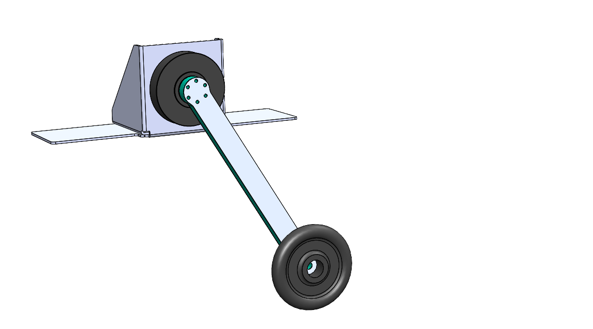

#  Hardware & Testbench Description

The `/hardware` directory contains all information about the hardware that is used to built the simple pednulum test bench, including a bill of materials, step files of the CAD model along with wiring diagrams for the complete set up as well as the CAN bus.  
  
We additionally uploaded all CAD files to grabcad.com. You can use the 3D viewer from their webiste to diplay the 3D model directly within your browser: [grabcad.com/simple_pendulum](https://grabcad.com/library/simple_pendulum-1)

  

  

### Physical Parameters of the Pendulum
-------------------------------------------------------------------- 

* Point mass: = 0.546 Kg 
* Mass of rod, mounting parts and screws:  = 0.13 Kg 
* Overall mass:  = 0.676 Kg
* Length to point mass:  = 0.5 m
* Length to COM:  = 0.45 m 

### Physical Parameters of the Actuator
--------------------------------------------------------------------  
The AK80-6 actuator from T-Motor is a quasi direct drive with a gear ratio of 6:1 and a peak torque of 12 Nm at the output shaft. The motor is equipped with an absolute 12 bit rotary encoder and an internal PD torque control loop. The motor controller is basically the same as the one used for MIT Mini-Cheetah, which is described in the documentation from Ben Katz.
- [Ben Katz: MIT Mini-Cheetah Documentation](https://docs.google.com/document/d/1dzNVzblz6mqB3eZVEMyi2MtSngALHdgpTaDJIW_BpS4/edit)

  

  

-------------------------------------------------------------------- 

* Voltage = 24 
* Current = rated 12 , peak 24 
* Torque = rated 6 , peak 12  (after the transmission)
* Transmission N = 6 : 1
* Weight = 485 
* Dimensions = ⌀ 98  x 38,5 
* Max. torque to weight ratio = 24  (after the transmission) 
* Max. velocity = 38.2  = 365  (after the transmission)
* Backlash (accuracy) = 0.15° degrees

### Motor Constants  
-------------------------------------------------------------------- 
 (before the transmission)  

- Motor constant km = 0.2206 
- Electric constant ke= 0.009524  
- Torque constant kt = 0.091 
- Torque = rated 1,092 , peak 2,184 
- Velocity / back-EMF constant kv = 100 
- Max. velocity at 24  = 251.2  = 2400 
- Motor wiring in -delta configuration
- Number of pole pairs = 21
- Resistance phase to phase = 170  5 
- Inductance phase to phase = 57  10 
- Rotor inertia Ir = 0.000060719 

  

# Electrical Setup

**Note:** We do not give any safety warranties on the electrical wiring. All experiments and reproductions of our test bed are at your own risk.   

The wiring diagram below shows how the simple pendulum testbench is set up. A main PC is connected to a motor controller board (**CubeMars_AK_V1.1**) mounted on the actuator (**AK80-6 from T-Motor**). The communication takes place on a CAN bus with a maximum signal frequency of 1Mbit/sec with the 'classical' CAN protocol. Furthermore, a USB to CAN interface is needed, if the main pc doesn't have a PCI CAN card. Two different devices are used in our setup: the **R-LINK module** from T-Motor and the **PCAN-USB adapter from PEAK systems**. The former has CAN and UART connectors at the output, but only works with Windows. The latter only features CAN connection, but also works with Linux. The UART connector of the R-LINK module is usefull to configure and calibrate the AK80-6.   

The actuator requires an input voltage of 24 Volts and consumes up to 24 Amps under full load. A power supply that is able to deliver both and which is used in our test setup is the **EA-PS 9032-40** from Elektro-Automatik. A capacitor filters the backEMF coming from the actuator and therefore protects the power supply from high voltage peaks. This wouldn't be necessary if the actuator is powered from a battery pack, as in this case backEMF simply recharges the batteries. The capacitor we use is made of **10x single 2.7V-400 F capacitor cells** connected in series resulting a total capacity of 40 F and is wired in parallel to the motor. A emergency stop button serves as additional safety measure. It disconnects the actuator from power supply and capacitor, if only the power supply gets diconnected the actuator will keep running with the energy stored in the capacitor.   

  

  

**Fig. 1:** actuator = AK80-6, controller board = CubeMars_AK_V1.1, power supply = EA-PS 9032-40, capacitor = 10x 2.7V-400F cells connected in series, USB-CAN interfaces = R-LINK module and PCAN-USB adapter.  

# backEMF
The reverse current resulting from switching motor speeds from high to low is called backEMF (Electro Magnetic Force). When the motor speed decreases the motor works as a generator, which converts mechanical energy into electrical energy and hence the additional current needs some path to flow. The energy recycled back into the input power supply causes a voltage spike and potential risk. It is necessary to add enough input capacitance to absorb this energy. A sufficiently large input capacitance is important in the desgin of the electric curcuit. It is beneficial to have more bulk capacitance, but the disadvantages are increased cost and physical size.

If the power source were a perfect battery, then energy would flow back into the battery and be recycled. However, in our case the power source is a DC power supply. Especially power supplies with an inverse-polarity protection diode can only source current and cannot sink current, hence the only place the energy can go is into the bulk capacitor. The amount of energy stored in the bulk capacitor can be calculated with

,

where **_C_** is the capacitance and **_V_** is the voltage. In the case of a Simple Pendulum max. backEMF can be estimated from the kinetic energy of the pendulum 

,

where **_m_** is the payload attached to the rod and **_v_** is the velocity of the payload. The voltage across the capacitor increases as energy flows into it, so the capacitor should be sized accordingly to the specific application requirements. Nevertheless tuning a capacitor to the acceptable min. capacity is tricky, because it depends on many factors including:
- External load
- Capacitance of the power supply to source current
- Motor braking method, output short brake or current polarity reversing brake.
- Amount of parasitic inductance between power supply and motor system, which limits the current change rate from the power supply. The larger the input capacitance, the more stable the motor voltage and higher current can be quickly supplied.
- The maximum supply voltage limit and acceptable voltage ripples

If the used capacitor is too small for your specific apllication it introduces the risk of burning the capacitor. The voltage rating for the bulk capacitors should be higher than the typical operating voltage and provide some safty margin. In our case we supply the AK80-6 with 24 V, whereas the capacitor can take up to 27 V. Therefore we have 3 V buffer, combined with a large capacity of 40 F, we ensure that during voltage spikes the capacitor never gets fully charged. If you don't want to buy a huge and expensive capacitor you may instead use a **break resistor**, which normally is cheaper to purchase. A guidance on this topic is provided [here](https://community.simplefoc.com/t/external-brake-resistor/973). One drawback using brake resistors is that they quickly heat up, if the motor frequently brakes and regenerates energy. Another option to prevent the bus voltage from spiking too high are **resistive shunt regulators**, e.g. like this one from [polulu](https://www.pololu.com/product/3775), but they can't dissipate much power and high-power versions also get expensive. 

# Communication: CAN Bus wiring
Along the CAN bus proper grounding and isolation is required. It is important to not connect ground pins on the CAN bus connectors between different actuators, since this would cause a critical ground loop. The ground pin should only be used to connect to systems with a ground isolated from the power ground. Additionally, isolation between the main pc and the actuators improves the signal quality. When daisy-chaining multiple actuators, only the CAN-High and CAN-Low pins between the drives must be connected. At the end of the chain a 120 Ohm resistor between CAN-H and CAN-L is used to absorb the signals. It prevents the signals from being reflected at the wire ends. The CAN protocol is differential, hence no additional ground reference is needed. The diagram below displays the wiring of the CAN bus.  
  
 

  

    
  

**Fig. 2:** main pc = CPU, CAN transceiver = CAN XCVR, actuator = AC
