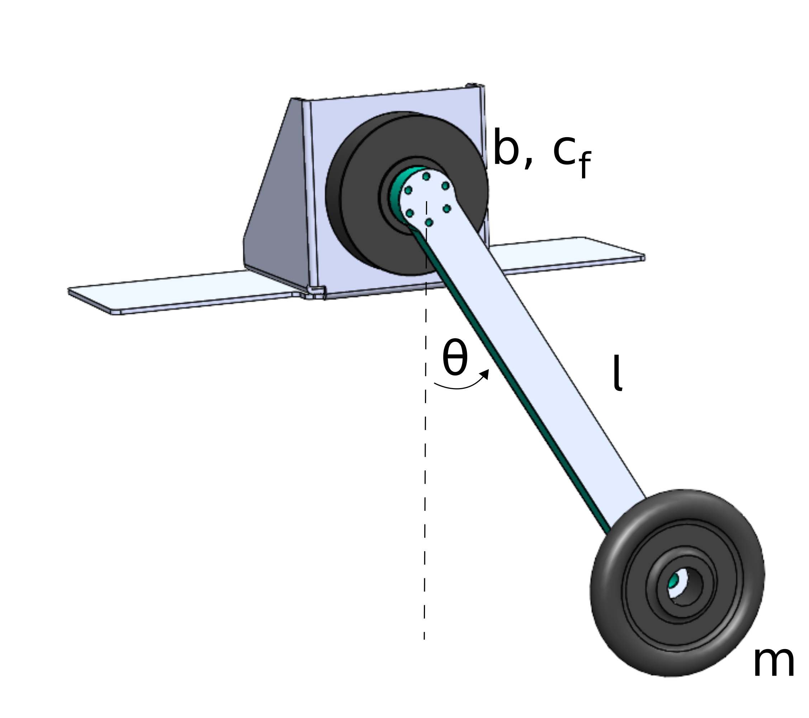
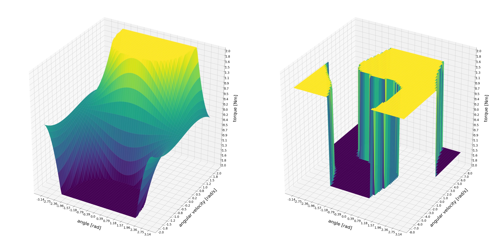

# Summary

There are many, wildly different approaches to robotic control.
Underactuated robots are systems for which it is not possible to dictate arbitrary accelerations to all joints. Hence, a controller cannot be used to overwrite the system dynamics and force the system on a desired trajectory as it often is done in classical control techniques.
A torque-limited pendulum is arguably the simplest underactuated robotic system and thus is a suitable system to study, test and benchmark different controllers.

This repository describes the hardware (CAD, Bill Of Materials (BOM) etc.) required to build a
physical pendulum system and provides the software (URDF models, simulation and controller) to control it. It provides a setup for studying established and novel control methods on a simple torque-limited pendulum, and targets students and beginners of robotic control.

# Statement of need

This repository is designed to be used in education and research. It targets lowering the entry barrier
for studying underactuation in real systems which is often overlooked in conventional robotics courses.
With this software package, students who want to learn about robotics, optimal control or reinforcement learning can make hands-on
experiences with hardware and software for robot control.
This dualistic approach of describing software and hardware is chosen to motivate experiments with real robotic hardware and facilitate the transfer between software and hardware.
To ensure reproducibility and evaluate novel control methods, not just the control methods' code but also results from experiments are available.

# Background

{#id .class height=400px}

A pendulum (\autoref{fig:pendulum}) is constructed by mounting a motor to a fixed frame, attaching a rod to the motor and attaching a weight to the other end of the rod. The motor used in this setup is the AK80-6 actuator from T-Motor, which is a quasi direct drive with a gear ratio of 6:1 and a peak torque of 12 Nm at the output shaft.

<!--
* Voltage = 24 $`V`$
* Current = rated 12 $`A`$, peak 24 $`A`$
* Torque = rated 6 $`Nm`$, peak 12 $`Nm`$ (after the transmission)
* Transmission N = 6 : 1
* Weight = 485 $`g`$
* Dimensions = ⌀ 98 $`mm`$ x 38,5 $`mm`$
* Max. torque to weight ratio = 24 $`Nm/kg`$ (after the transmission)
* Max. velocity = 38.2 $`rad/s`$ = 365 $`rpm`$ (after the transmission)

{#id .class height=400px}

The physical parameters of the pendulum are:

* Point mass: $m_p$= 0.546 kg
* Mass of rod, mounting parts and screws: $m_r$ = 0.13 kg
* Overall mass: $m$ = 0.676 kg
* Length to point mass: $l$ = 0.5 m
* Length to COM: $l_{COM}$ = 0.045 m
-->

## Electrical Setup

The schematic below (\autoref{fig:electrical_schematic}) displays the electrial setup of the testbench. A main PC is connected to a motor controller board (CubeMars_AK_V1.1) mounted on the actuator (AK80-6 from T-Motor). The communication takes place on a CAN bus with a maximum signal frequency of 1Mbit/sec with the 'classical' CAN protocol. Furthermore, a USB to CAN interface is needed, if the main pc doesn't have a PCI CAN card. The actuator requires an input voltage of 24 Volts and consumes up to 24 Amps under full load. A power supply that is able to deliver both and which is used in our test setup is the EA-PS 9032-40 from Elektro-Automatik. A capacitor filters the backEMF coming from the actuator and therefore protects the power supply from high voltage peaks. An emergency stop button serves as additional safety measure.

{#id .class height=800px}

<!--
## CAN bus wiring

Along the CAN bus proper grounding and isolation is required. It is important to not connect ground pins on the CAN bus connectors between different actuators, since this would cause a critical ground loop. The ground pin should only be used to connect to systems with a ground isolated from the power ground. Additionally, isolation between the main pc and the actuators improves the signal quality. When daisy-chaining multiple actuators, only the CAN-High and CAN-Low pins between the drives must be connected. At the end of the chain a 120 Ohm resistor between CAN-H and CAN-L is used to absorb the signals. It prevents the signals from being reflected at the wire ends. The CAN protocol is differential, hence no additional ground reference is needed. The diagram below displays the wiring of the CAN bus.

{#id .class height=200px}
-->

## Pendulum Dynamics

The equations of motion of a pendulum are

$$I\ddot{\theta} + b\dot{\theta} + c_f \text{sign}(\dot{\theta}) + mgl \sin(\theta) = \tau$$

where

- $\theta$, $\dot{\theta}$, $\ddot{\theta}$ are the angular displacement, angular velocity and angular acceleration of the pendulum. $\theta=0$ means the pendulum is at its stable fixpoint (i.e. hanging down).
- $I$ is the inertia of the pendulum. For a point mass: $I=ml^2$
- $m$ mass of the pendulum
- $l$ length of the pendulum
- $b$ damping friction coefficient
- $c_f$ coulomb friction coefficient
- $g$ gravity (positive direction points down)
- $\tau$ torque applied by the motor

This project provides an easy accessible plant for the pendulum dynamics which is built up from scratch and uses only standard libraries. The plant can be passed to a simulator object, which is capable of integrating the equations of motion and thus simulating the pendulum's motion forward in time. The simulator can perform Euler and Runge-Kutta integration and can also visualize the motion in a matplotlib animation. Furthermore, it is possible to interface a controller to the simulator which sends control a signal in form of a torque $\tau$ to the motor.

The pendulum has two fixpoints, one of them being stable (the pendulum hanging down) and the other being unstable (the pendulum pointing upwards). A challenge from the control point of view is to swing the pendulum up to the unstable fixpoint and stabilize the pendulum in that state.

## Control Methods

The swing-up challenge with a limited motor torque $\tau$ serves as a benchmark for various control algorithms. If the torque limit is set low enough, the pendulum is no longer able to simply go up to the unstable fixpoint but instead the pendulum has to swing and built up energy in the system.

{#id .class height=800px}

The control methods that are currently implemented in this library (see also \autoref{fig:software_structure}) can be grouped in three categories:

**Trajectory optimization** tries to find a trajectory of control inputs and states that is feasible for the system while minimizing a cost function. The cost function can for example include terms which drive the system to a desired goal state and penalize the usage of high torques. The following trajectory optimization algorithms are implemented:

- Direct Collocation [@hargraves1987direct]
- Iterative Linear Quadratic Regulator (iLQR) [@weiwei2004iterative]
- Feasibility driven Differential Dynamic Programming (FDDP) [@mastalli2020crocoddyl]

**Closed Loop Controllers** or feedback controllers take the state of the system as input and ouput a control signal. Because they are able to react to the current state, they can cope with perturbations during the execution. The following feedback controllers are implemented:

- Energy Shaping
- Linear Quadratic Regulator (LQR)
- Gravity Compensation
- Model Predictive Control (MPC) with iLQR

**Reinforcement Learning** (RL) can be used to learn a policy on the state space of the robot. The policy, which has to be trained beforehand, receives a state and outputs a control signal like a feedback controller. The simple pendulum is can be formulated as a RL problem with two continuous inputs and one continuous output. Similar to the cost function in trajectory optimization, the policy is trained with a reward function. The following RL algorithms are implemented:

- Soft Actor Critic (SAC) [@haarnoja2018soft]
- Deep Deterministic Policy Gradient (DDPG) [@lillicrap2019continuous]

This repository is designed to welcome contributions in form of novel optimization methods/controllers/learning algorithms to extend this list.

## Tools

To get an understanding of the functionality of the implemented controllers they can be visualized in the pendulum's state space. Example visualizations of the energy shaping controller and the policy learned with DDPG are shown in figure \autoref{fig:controller_plots}.

{#id .class height=600px}

Furthermore, the swing-up controllers can be benchmarked, where it is evaluated how fast, efficient, consistent, stable and sensitive the controller is during the swing-up.

<!--
See figure \autoref{fig:benchmark} for the examplary results of the energy shaping controller.

{#id .class height=1200px}
-->

<!--
# Citations

Citations to entries in paper.bib should be in
[rMarkdown](http://rmarkdown.rstudio.com/authoring_bibliographies_and_citations.html)
format.

If you want to cite a software repository URL (e.g. something on GitHub without a preferred
citation) then you can do it with the example BibTeX entry below for @fidgit.

For a quick reference, the following citation commands can be used:
- `@author:2001`  ->  "Author et al. (2001)"
- `[@author:2001]` -> "(Author et al., 2001)"
- `[@author1:2001; @author2:2001]` -> "(Author1 et al., 2001; Author2 et al., 2002)"

# Figures

Figures can be included like this:

and referenced from text using \autoref{fig:example}.

Figure sizes can be customized by adding an optional second parameter:
{ width=20% }
-->

# Acknowledgements

This work has been performed in the VeryHuman project funded by the German Aerospace Center (DLR) with federal funds (Grant Number: FKZ 01IW20004) from the Federal Ministry of Education and Research (BMBF) and is additionally supported with project funds from the federal state of Bremen for setting up the Underactuated Robotics Lab (Grant Number: 201-001-10-3/2021-3-2).

# References
