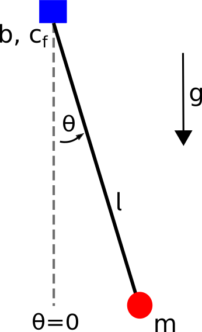

# Summary

There are many, wildly different approaches to robotic control. This torque limited simple 
pendulum repository provides a setup for testing established and novel control 
methods in a simple, well understood environment.
This repository describes the hardware (CAD, Bill Of Materials (BOM) etc.) required to build the
physical system and provides the software (URDF models, simulation and controller) to control it.
Results from experiments are available to ensure reproducibility.

# Statement of need

This repository is designed to be used in education and research. It targets lowering the entry barrier 
for studying underactuation in real systems which is often overlooked in conventional robotics courses.
Students who want to learn about robotics, optimal control or reinforcement learning can make hands-on
experiences with this software package. 


# System Design

# Pendulum Dynamics

<div align="center">

</div>

The equations of motion of a pendulum are

```math
\begin{equation}
I\ddot{\theta} + b\dot{\theta} + c_f \text{sign}(\dot{\theta}) + mgl \sin(\theta) = \tau
\end{equation}
```

where

- $`\theta`$, $`\dot{\theta}`$, $`\ddot{\theta}`$ are the angular displacement, angular velocity and angular acceleration of the pendulum. $`\theta=0`$ means the pendulum is at its stable fixpoint (i.e. hanging down).
- $`I`$ is the inertia of the pendulum. For a point mass: $`I=ml^2`$
- $`m`$ mass of the pendulum
- $`l`$ length of the pendulum
- $`b`$ damping friction coefficient
- $`c_f`$ coulomb friction coefficient
- $`g`$ gravity (positive direction points down)
- $`\tau`$ torque applied by the motor

# Controllers

# Results

<!--
# Citations

Citations to entries in paper.bib should be in
[rMarkdown](http://rmarkdown.rstudio.com/authoring_bibliographies_and_citations.html)
format.

If you want to cite a software repository URL (e.g. something on GitHub without a preferred
citation) then you can do it with the example BibTeX entry below for @fidgit.

For a quick reference, the following citation commands can be used:
- `@author:2001`  ->  "Author et al. (2001)"
- `[@author:2001]` -> "(Author et al., 2001)"
- `[@author1:2001; @author2:2001]` -> "(Author1 et al., 2001; Author2 et al., 2002)"

# Figures

Figures can be included like this:

and referenced from text using \autoref{fig:example}.

Figure sizes can be customized by adding an optional second parameter:
{ width=20% }
-->

# Acknowledgements

# References
